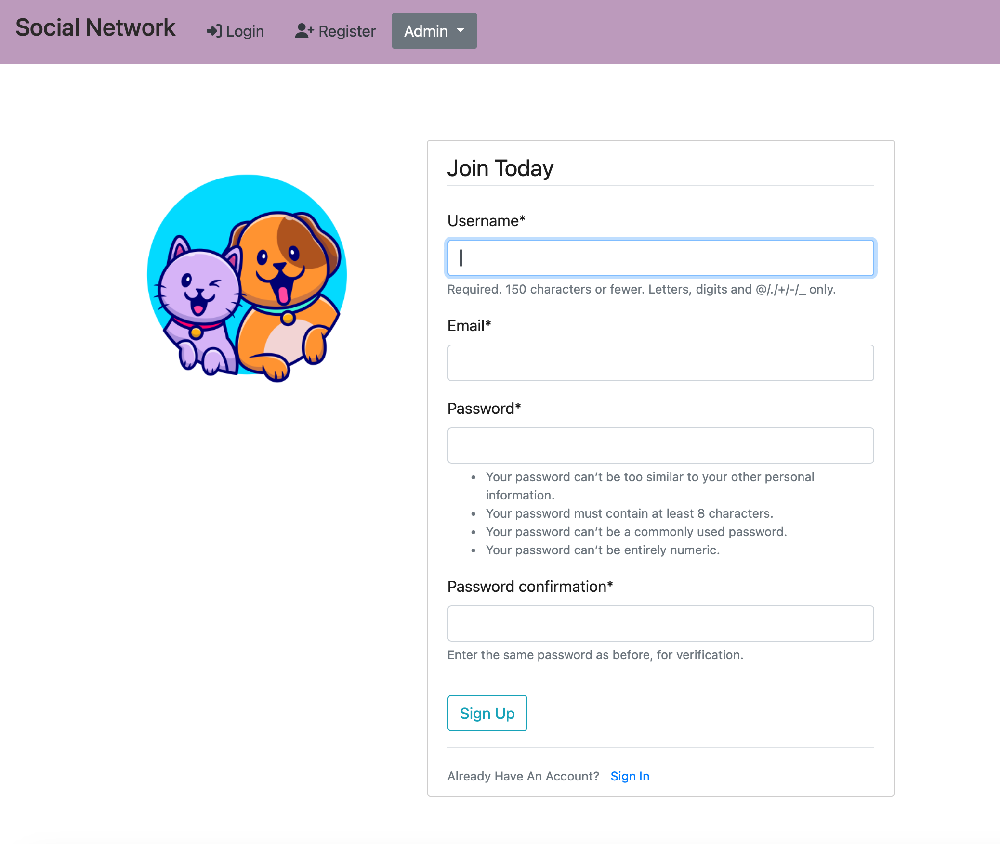
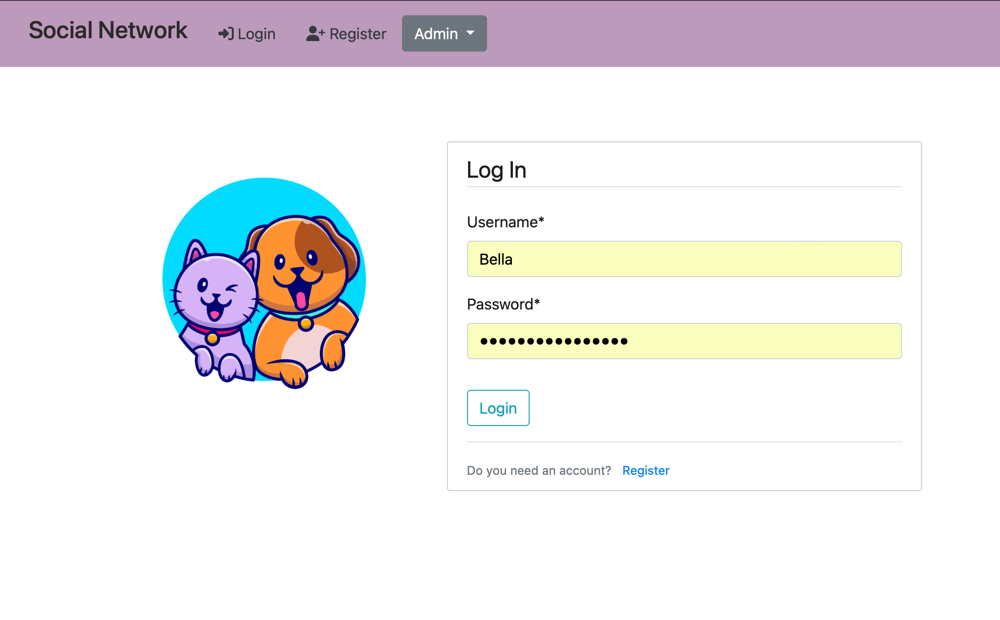
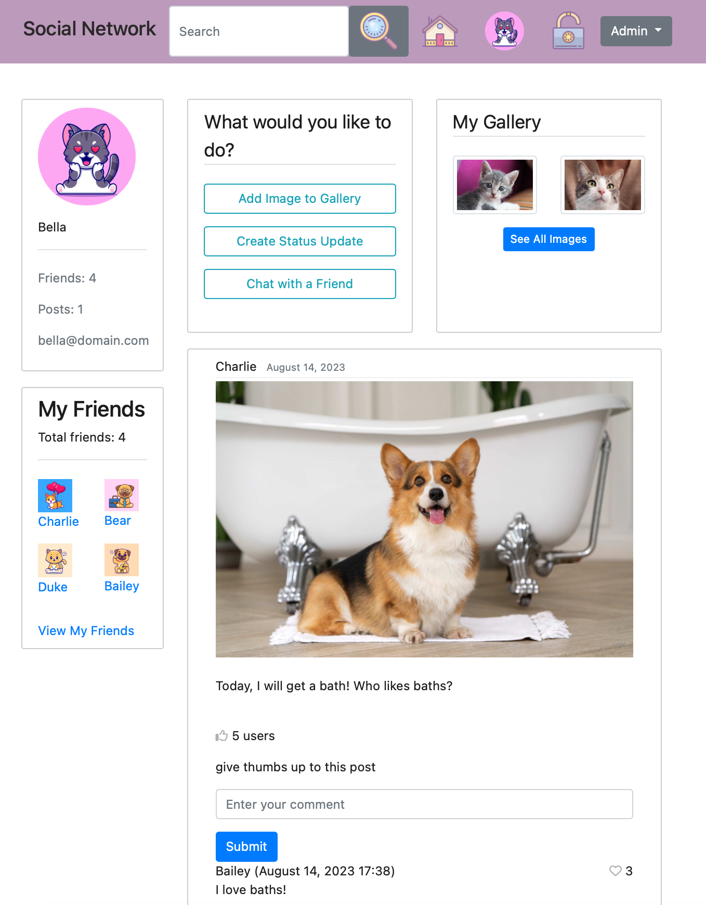
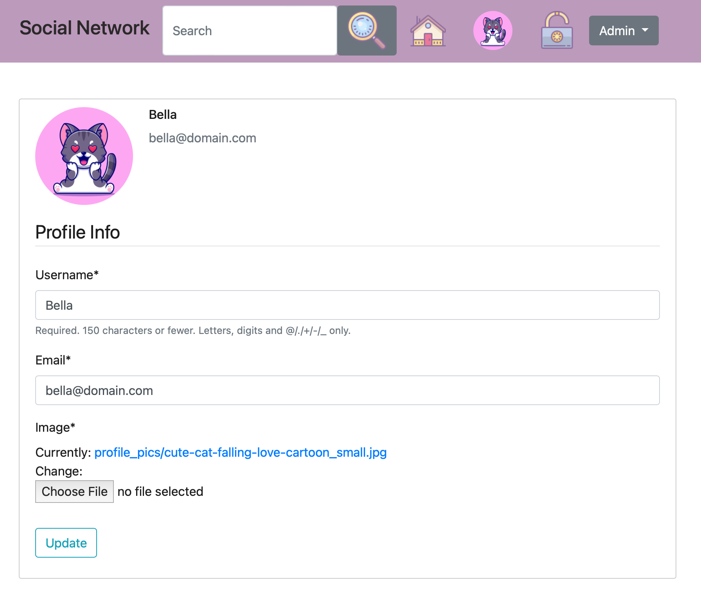
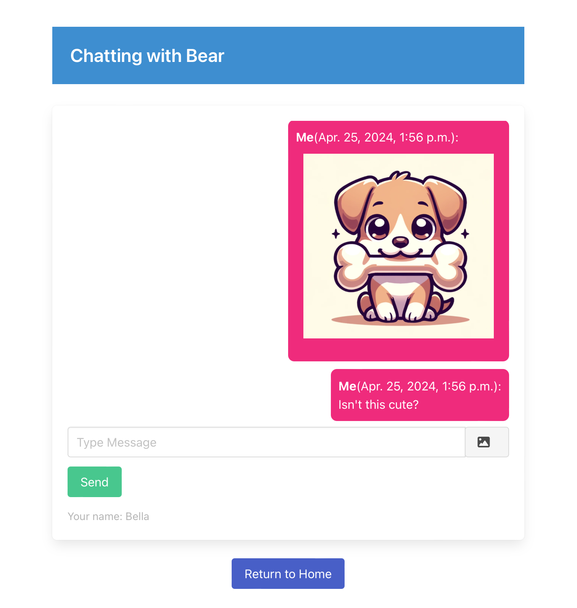
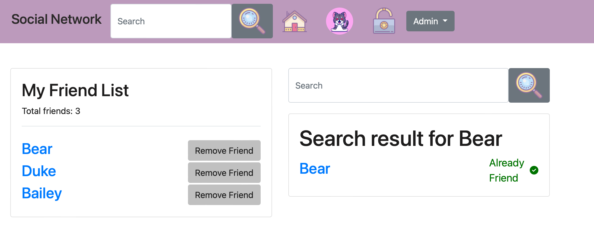

# Social Network for Pets

## Table of Contents

1. [Project Overview](#project-overview)
2. [Links](#links)
3. [Django Admin Login](#django-admin-login)
4. [Development Environment](#development-environment)
5. [Project Setup and Installation](#project-setup-and-installation)
6. [Token Authentication](#token-authentication)
7. [Data Loading - Database Export and Import Scripts](#data-loading---database-export-and-import-scripts)
8. [Unit Tests Instructions](#unit-tests-instructions)
9. [Final Design](#final-design)

### Project Overview
This social network is the ultimate social hub where pets take the lead! Imagine a whimsical world where your furry friends curate their profiles, make pawsome connections, and share their daily escapades. From the fluffiest kitties to the bounciest bunnies, pets of all types come together to sniff out new pals, schedule playdates, and post the cutest of their nine lives. Whether it's a sunbathing iguana or a parkour-loving pup, this social network is where they all bark, meow, and chirp about it. Dive into this furry fiesta where pets aren’t just man’s best friend—they're each other's too!

#### Links

AWS EC2 Deployed Project:

	http://16.171.18.198:8000/

#### Django Admin Login

Username: XXXXX
Password: XXXXX

In the event of login problem, please create a new superuser and follow terminal instructions

	python manage.py createsuperuser

#### Development Environment

Operating System: Project was developed on MacOS Ventura 13.4.1 (c)
Browser Testing: Project was tested in Chrome Browser and Safari

- Python version: Python 3.10.9
- Django 4.2.1

Database: SQLite3

#### Project Setup and Installation

1. Unzip the project folder

2. Navigate to the project directory
	cd [file name]

3. Create a virtual environment
	python3.10 -m venv venv

4. Activate the virtual environment
	source venv/bin/activate

5. Install the dependencies
	pip install --use-pep517 -r requirements.txt

6. Navigate to the source folder
	cd src

7. Start the development server
	python manage.py runserver

8. Visit localhost to view the project
	http://127.0.0.1:8000/

If installation was unsuccessful
•	review installation errors in terminal 
•	review documentation to solve errors

#### Token Authentication

Token Auth Verification for API Script - IMPORTANT run script in terminal window, while server is running in another terminal

Go to project folder 
1. cd [file name]
2. source venv/bin/activate
3. cd src
4. python token_auth_api_script.py

To visually inspect if tokens authentication is working, please use ModHeader Extension

1. download extension

https://chrome.google.com/webstore/detail/modheader-modify-http-hea/idgpnmonknjnojddfkpgkljpfnnfcklj

2. select "Request Headers"

3. fill in:
	Authorization
	Token xxxxxxTokenxxxHerexxxxxxxx

#### Data Loading - Database Export and Import Scripts

Database Export: 
if in root directory, run this:
	python scripts/export_db_script.py

if in scripts/directory, run this
	python export_db_script.py

Database and archived media will be saved in exported_data folder in root directory

Database Import: 
if in root directory, run this:
	python scripts/import_data_script.py

if in scripts/directory, run this
	python import_data_script.py

#### Unit Tests Instructions: 

**Social**

	python manage.py test social.tests.test_chat

	python manage.py test social.tests.test_form_gallery

	python manage.py test social.tests.test_friends

	python manage.py test social.tests.test_gallery

	python manage.py test social.tests.test_models

	python manage.py test social.tests.test_post_api

	python manage.py test social.tests.test_post_forms

	python manage.py test social.tests.test_posts_comments

	python manage.py test social.tests.test_profile

	python manage.py test social.tests.test_serializers

	python manage.py test social.tests.test_tags

**Users**

	python manage.py test users.tests.test_api

	python manage.py test users.tests.test_forms

	python manage.py test users.tests.test_profile

	python manage.py test users.tests.test_register

	python manage.py test users.tests.test_serializers

	python manage.py test users.tests.test_signals

	python manage.py test users.tests.test_tags

	python manage.py test users.tests.test_users

run all passing tests: 

	python manage.py test

#### Final Design
  
_This is the registration page of the social network._

  
_This is the login page of the social network._

  
_This is a home page._

  
_This is a user profile page._

  
_This is where pets can chat._

  
_This is where pets can find friends._
	
*Author: https://github.com/randomoi/*